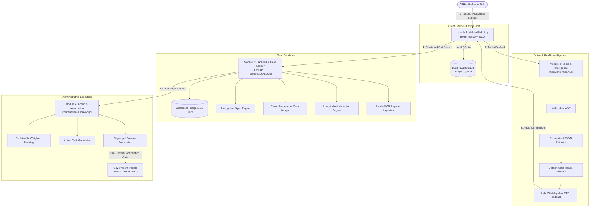

# സ്വരം • SWARAM
### Voice-Agentic Field Assistant & Care-Gap Intelligence for ASHA Workers

> **"Zero typing. Zero reading. Every clinical record confirmed by the worker before it is filed."**  
> *A modular, voice-first, offline-ready healthcare system tailored for India's Accredited Social Health Activists (ASHAs).*

---

## 📌 What is Swaram?

**Swaram** is an intelligent, voice-first mobile field assistant engineered specifically around the real-world workflow and constraints of **ASHA workers** (Accredited Social Health Activists) operating in grassroots rural and peri-urban healthcare in India (tailored for Kerala / Malayalam language context).

### The Real-World Problem
ASHA workers represent the frontline of India's public healthcare system, conducting routine household visits across maternal care, child immunisations, communicable diseases, non-communicable diseases (NCDs), and nutrition. However, their day-to-day effectiveness is severely hampered by:
1. **Administrative Overhead:** A typical ASHA spends 30–50% of her working hours transcribing the same field encounters across multiple physical paper registers and disparate government portals (RCH, ANMOL, NCD Portal).
2. **Double Documentation:** Recording observations on paper during visits, and then manually re-entering them on slow web portals at night.
3. **Fragmented Programme Silos:** Maternal care, child immunisation, and nutrition are managed in separate vertical silos. Critical cross-programme care gaps (e.g. an overdue vaccine in an anemic mother's household) easily slip through the cracks.
4. **Typing & Screen Fatigue:** Small mobile screens and complex English form fields are poorly suited for busy field visits in bright sunlight and intermittent connectivity.

### The Swaram Solution
With Swaram, the ASHA worker **does not type or navigate dense multi-step web forms**. Instead:
1. She conducts the visit and **speaks one natural Malayalam summary** into her phone.
2. Swaram transcribes the audio using Malayalam ASR (**IndicConformer**), extracts structured clinical entities into a constrained JSON schema, runs deterministic physiological validation, and detects uncertainties.
3. Swaram **reads the structured record back in Malayalam** (**IndicF5 TTS**) for the worker's verification.
4. The worker confirms or speaks corrections. **No clinical or reporting record is ever committed without explicit human confirmation.**
5. Swaram automatically maintains a **longitudinal Household Unresolved Care Ledger**, identifies overdue care gaps across programmes, guides conversational gap-closing questions, and dispatches browser automation (**Playwright**) to populate government reporting portals.
6. The entire field workflow operates **100% offline-first** using SQLite and an event-based sync queue.

---

## 🏛️ System Architecture



---

## 👥 Four-Person Modular Work Division

To ensure rapid, collision-free development, the project is strictly divided into **four decoupled folders**, each owned by one team member and bounded by frozen cross-module contracts.

| Folder | Owner | Domain | Tech Stack | Primary Deliverables |
|---|---|---|---|---|
| **[`module1-mobile/`](./module1-mobile/)** | **Member 1 (Lead)** | ASHA Mobile & Conversation UX | React Native, Expo, TypeScript, Zustand, `expo-sqlite` | Field UI, audio record button, review cards, offline SQLite queue, live API client with mock fallback, system integration. |
| **[`module2-voice-intelligence/`](./module2-voice-intelligence/)** | **Member 2** | Voice, Screening & Health Intelligence | Python 3.10+, FastAPI, Pydantic, IndicConformer, IndicF5 | Malayalam ASR adapter, clinical regex/LLM extractor, deterministic physiological validator, TTS readback, conversational gap-closer. |
| **[`module3-backend-ocr-ledger/`](./module3-backend-ocr-ledger/)** | **Member 3** | Canonical Data, Sync, OCR & Care Ledger | Python 3.10+, FastAPI, SQLAlchemy, PaddleOCR | REST API, idempotent offline sync (`/sync/push`), register OCR table extractor, cross-programme Unresolved Care Ledger, narrative generator. |
| **[`module4-reporting-priorities/`](./module4-reporting-priorities/)** | **Member 4** | Action, Government Reporting & Prioritisation | Python 3.10+, Playwright, Jinja2, FastAPI | Explainable priority scoring engine (`0-100`), action item generator, controlled mock government portal, Playwright form filler with confirmation gate. |

---

## 📋 Core Frozen Contracts (`contracts/`)

All modules communicate exclusively through typed, frozen schemas located in [`contracts/`](./contracts/):
- **`VisitDraft`** ([`visit.schema.json`](./contracts/visit.schema.json)): Output of Malayalam ASR + extraction pipeline prior to worker confirmation.
- **`ConfirmedVisit`** ([`visit.schema.json`](./contracts/visit.schema.json)): Human-confirmed clinical encounter payload with vitals, medications, and audit timestamps.
- **`CareGap`** ([`care_gap.schema.json`](./contracts/care_gap.schema.json)): Normalized representation of an unresolved health need across Maternal, Child, Nutrition, NCD, or Mental Health programmes.
- **`HouseholdCareLedger`** ([`care_ledger.schema.json`](./contracts/care_ledger.schema.json)): Household-level collection of open gaps, priority score, and longitudinal narrative.
- **`PreparedForm`** ([`reporting.schema.json`](./contracts/reporting.schema.json)): Mapped fields ready for Playwright portal population.
- **`OCRRegisterContract`** ([`ocr.schema.json`](./contracts/ocr.schema.json)): Digitised paper register rows with confidence and household candidate matches.

---

## ⚡ Quick Start: Running the Modules

### Prerequisites
- **Node.js**: v18+ (v22 installed)
- **Python**: 3.10+ (3.12 installed)

---

### 1. Launch Module 1 (Mobile Application)
```bash
cd module1-mobile
npm install
npm run web
```
> **Offline-Safe by Design:** The mobile app boots immediately. Its built-in API client (`apiClient.ts`) tests the live backend connection via a dedicated **"Test API Call"** button. If the backend is offline, it seamlessly falls back to local contracts in `src/data/mockData.ts`.

---

### 2. Launch Module 2 (Voice & Intelligence Service)
```bash
cd module2-voice-intelligence
python -m venv .venv
# On Windows: .venv\Scripts\activate
# On Linux/Mac: source .venv/bin/activate
pip install -r requirements.txt
python main.py
```
> Service runs on **`http://localhost:8001`**. Exposes `/api/v1/voice/process` and `/api/v1/voice/tts`.

---

### 3. Launch Module 3 (Backend & Care Ledger)
```bash
cd module3-backend-ocr-ledger
python -m venv .venv
# On Windows: .venv\Scripts\activate
# On Linux/Mac: source .venv/bin/activate
pip install -r requirements.txt
cd app
python main.py
```
> Server runs on **`http://localhost:8000`**. Interactive Swagger API docs: **`http://localhost:8000/docs`**.

---

### 4. Launch Module 4 (Mock Portal & Playwright Automation)
```bash
cd module4-reporting-priorities
python -m venv .venv
# On Windows: .venv\Scripts\activate
# On Linux/Mac: source .venv/bin/activate
pip install -r requirements.txt
playwright install chromium

# Terminal A: Start Mock Government Portal
python portal_mock/mock_server.py # Runs on http://localhost:8080

# Terminal B: Start Priority & Automation Service
python main.py                   # Runs on http://localhost:8002
```

---

## 🎬 Recommended Demo Scenario: "Lakshmi Household"

To experience the complete end-to-end loop during an evaluation or hackathon pitch:
1. **Open Mobile App:** Launch `module1-mobile` and inspect **Lakshmi Amma's Household (Ward 4)**. Note the priority score (88.5) and the 2 overdue care gaps (3rd Trimester ANC BP check overdue 8 days; child MR vaccine pending).
2. **Trigger Voice Visit:** Tap the large green button **"സംസാരിക്കുക (Simulate Voice Visit)"**.
3. **Malayalam Processing:** Observe the audio pipeline convert the Malayalam utterance:
   > *"ലക്ഷ്മിയെ കണ്ടു. ബിപി 130/85 ഉണ്ട്. ഭാരം 58 കിലോ. അയൺ ഗുളിക കൊടുത്തു. അടുത്ത ചെക്കപ്പ് അടുത്ത വ്യാഴാഴ്ച."*
4. **Clinical Extraction Preview:** Notice how Swaram extracts BP (`130/85 mmHg`), Weight (`58 kg`), Medication (`Iron-Folic Acid Tablets`), and Follow-up Date (`2026-09-12`) without touching a keyboard.
5. **Human Confirmation Gate:** Tap **"✓ ശരിയാണ് (Confirm & Save)"**. The record is committed locally and added to the sync queue.
6. **Care Ledger Update & Reporting:** Observe the Unresolved Care Ledger update, while Module 4 maps the confirmed visit to the Mock Government Portal (`http://localhost:8080`) using Playwright with accessible locators.

---

## 🛡️ Non-Negotiable Safety & Privacy Rules
- **No AI Diagnosis Claims:** Swaram flags missing information and overdue observations. It **never** presents an AI inference as a clinical diagnosis.
- **Human Confirmation Gate:** Zero automated submissions without the ASHA worker's explicit review and approval.
- **No Hardcoded Credentials:** Never store real worker passwords or government portal credentials in git.
- **Synthetic Data for Demos:** All demo personas (Lakshmi Amma, Suresh Kumar) are synthetic test records.

---

## 📄 License & Team Contribution
Developed as a modular prototype for frontline healthcare enablement. See [`CONTRIBUTING.md`](./CONTRIBUTING.md) for team branching strategy and pull request guidelines.
